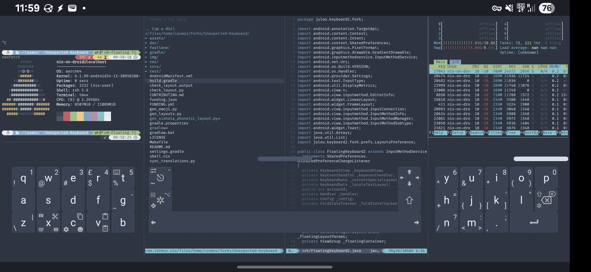
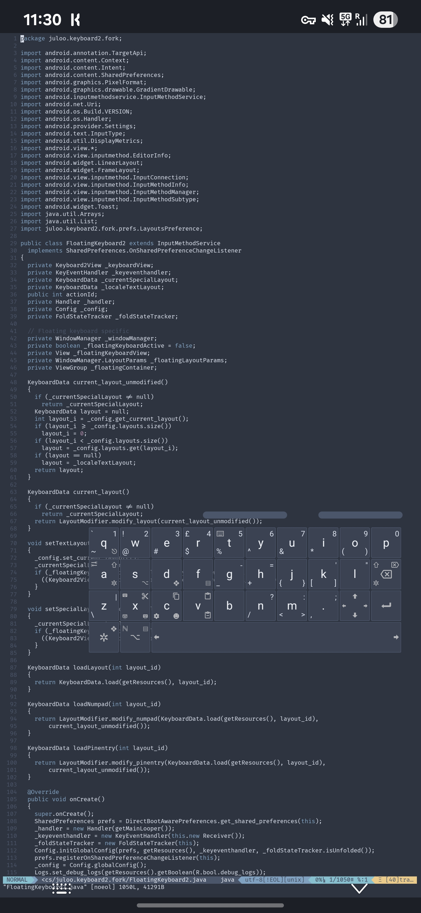

# Unexpected Keyboard (Experimental Fork)

*Note: This fork was entirely undertaken by Claude Code as part of my testing of CC - after a few false starts, humblingly, all works well enough for me to daily-drive. I've made a point of not writing a single line of this myself, besides prompting CC and parts of this README. Unless extremely brave I'd suggest not relying on this fork which is extremely tailored to how I use UK, and instead following mainline development.*

A personal fork of [Unexpected Keyboard](https://github.com/Julow/Unexpected-Keyboard) with additional features I've wanted as I've gradually increased the amount of code I'm writing on my phone (essentially testing out LLMs as a way of achiving "arbitrary dotfiles" for adding customisation to apps that don't otherwise expose it)

## Features Added

### Floating IME
- **Floating mode**: Detach keyboard from bottom of screen as a draggable floating window
  - No longer takes up screen real estate, apps flow to use the full space
  - Floating and docked modes are separate IMEs, switching back-and-forth is via system input toggle
- **Resizing**: On-the-fly resizing of the keyboard with remembered position and size for landscape and portrait
- **Fast toggle**: tapping a gap on the surface disables the keyboard, re-enabled by a small handle, passing through touches and swipes
  - Indended for use with split layouts, makes landscape mode much more usable

Floating resizable landscape with split layout:

Floating resizable portrait with ortho layout:

### Layout Loading from Storage
- Load / refresh XML keyboard layouts from device storage
- **Layout management**: Remove all custom layouts, replace duplicates by name, alphabetical sorting
- Pairs with a [Nix module](https://github.com/harryaskham/collective-public/blob/main/modules/agnostic/unexpected-keyboard/default.nix) for generating XML layouts from within Nix-on-Droid that are copied to e.g. `/storage/emulated/0/shared/unexpected_keyboard` on activation.

### Advanced Key Actions
- **Layout switching**: `switch_to_layout_<layoutName>` key action for direct layout switching via shortcuts
- **Floating control**: `toggle_floating` switches between docked and floating IME modes  
- **Persistence toggle**: `toggle_persistence` controls floating keyboard persistence (stays visible when no text field focused)
- **Quick disable**: Always-present enable/disable toggle for temporary keyboard hiding

### Misc
- **Nord colorscheme**: Adds Nord theme as native
- **Debug mode**: On-device debug mode exposing select logs via toasts (largely for testing further UK development with Claude Code from my device when I'm remote and can't access `adb logcat`, but can still build UK remotely and ship the APK to my device via e.g. `scp`)

## Build

Added a `make {debug,release,clean}` for Claude to use to build on Nix-enabled systems, since Claude kept forgetting how to build when the conversation was compacted and `shell.nix` wasn't working when I was testing.

## TODO

### Features & Functionality

- Entire app config is possible to drive from storage as e.g. `.unexpected_keyboard.json`, not just layouts.
- Make it possible to enter system shortcuts using the keyboard (i.e. alt-tab for app switching, meta-h to show the launcher, etc, as supported natively by Android for hardware keyboards)
